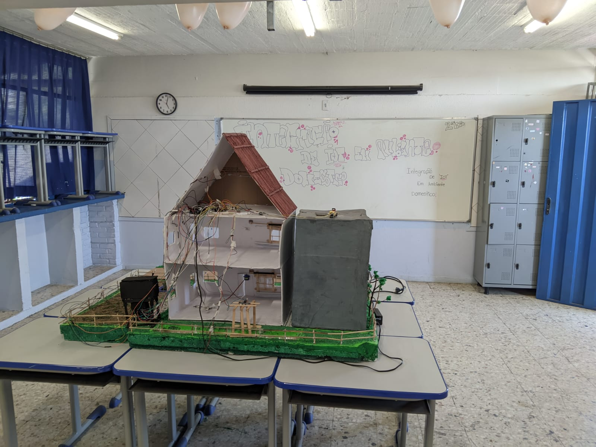
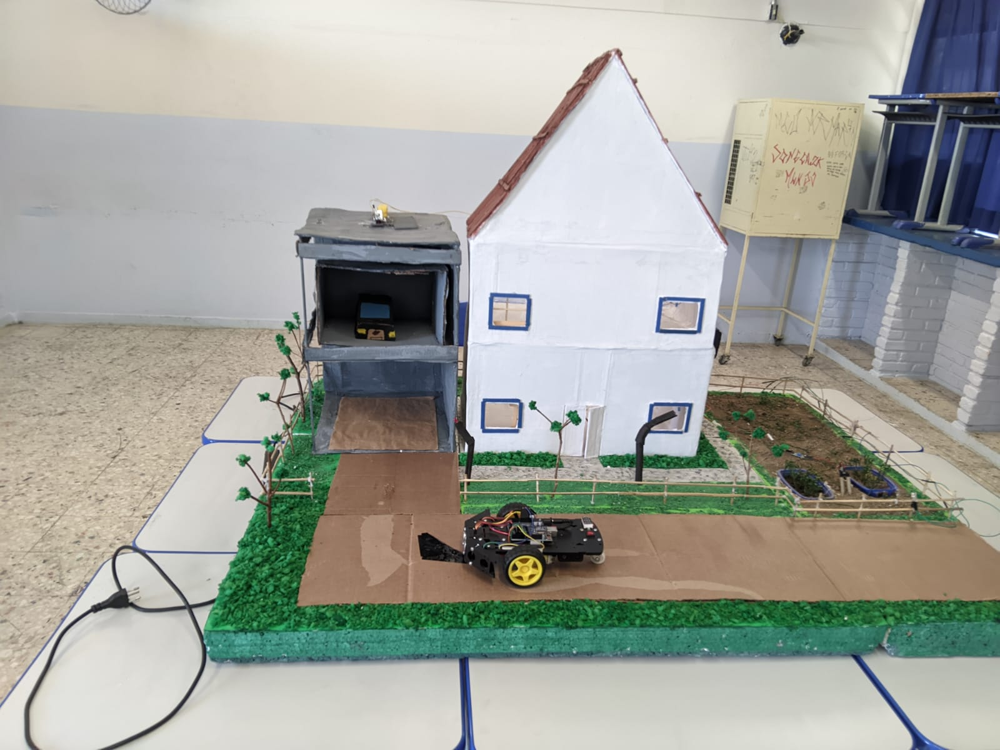

# **Casa Inteligente com Arduino**

Este projeto escolar, desenvolvido para a Feira de Informática, demonstra a automação de uma casa inteligente utilizando **Arduino**. A casa é equipada com diversos sistemas automatizados que visam aumentar o conforto e a eficiência do ambiente, como controle do solo, automação de janelas, controle de iluminação e um elevador. O objetivo é criar um ambiente mais inteligente e acessível com o uso de tecnologias simples e de fácil implementação.

## **Funcionalidades do Sistema**

- **Controle de Irrigação**: Sistema automatizado para controlar a umiade do solo.
- **Automação de Janelas**: Controle automático da abertura e fechamento das janelas, dependendo da presença de chuva.
- **Postes de Iluminação**: Acendimento automático dos postes de iluminação baseando-se na intensidade da luz ambiente, usando sensores LDR.
- **LEDs de Palmas**: Ação ativada por sensor de som para acender LEDs quando um som é detectado.
- **Elevador Automático**: Controle de um elevador para a garagem, que é acionado automaticamente.
- **Detecção de Inundações**: Sistema para detectar quando o nível do rio está elevado, indicando risco de alagamento.

## **Materiais Utilizados**

- **Arduino Uno**
- **Sensores**:
  - Sensor de umidade
  - Sensor de Luz (LDR)
  - Sensor ultrassônico
  - Sensor de ruído
  - Sensor de chuva
- **LEDs**
- **Ponte H**
- **Buzzer**
- **LCD**
- **Botões**
- **Resistores**
- **Servo Motor**
- **Motores**
- **Protoboard** 

## **Imagens do Projeto**

  
  

